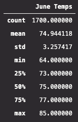
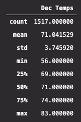

# Surfs Up - Hawaii Weather Analysis Using SQLite

## Overview of Project

### Purpose

The purpose of the analysis is well defined. (3 pt)

### Resources
- Data: [hawaii.sqlite](hawaii.sqlite)
- Software: Python 3.7.9, sqlalchemy 1.3.20, Visual Studio Code 1.52.1, pandas 1.1.3, numpy 1.19.2

## Project Results

### Data Generated

- [june_temps.png](Resources/june_temps.png) (displayed below on the left)
- [dec_temps.png](Resources/dec_temps.png) (displayed below on the right)

### Results
- Three key differences between June's weather and December's weather:
  1. The measures of central tendency are closer than I expected.
      - Means only differ by 3.9°F
      - Medians ('50%' in tables above) only differ by 4°F
  2. The minimum recorded temperature in December is 9°F less than the minimum recorded temperature in June
  3. The maximum recorded temperature in December is only 2°F less than the maximum recorded temperature in June

## Summary

### Observations
###### Queries that are referenced in this section can be found in [additional_queries.ipynb](Resources/additional_queries.ipynb)

A final thought is to ask ourselves the question, "Are June and December the best months to look at to represent peak warm weather and peak cold weather?" From the thrid query, the answer appears to be no. From our dataset,January has the lowest average temperature and the months of July, August, September, and October all have average temperatures higher than June. 

There is a high-level summary of the results and there are two additional queries to perform to gather more weather data for June and December. (5 pt)

Look at precipitation in these months
